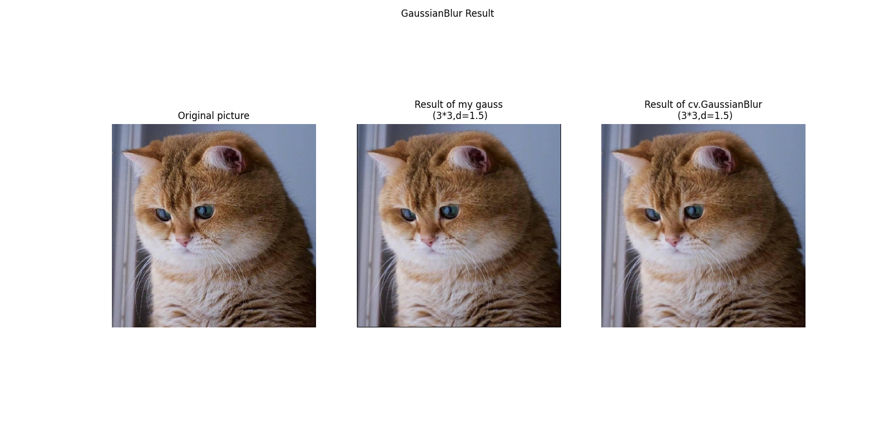
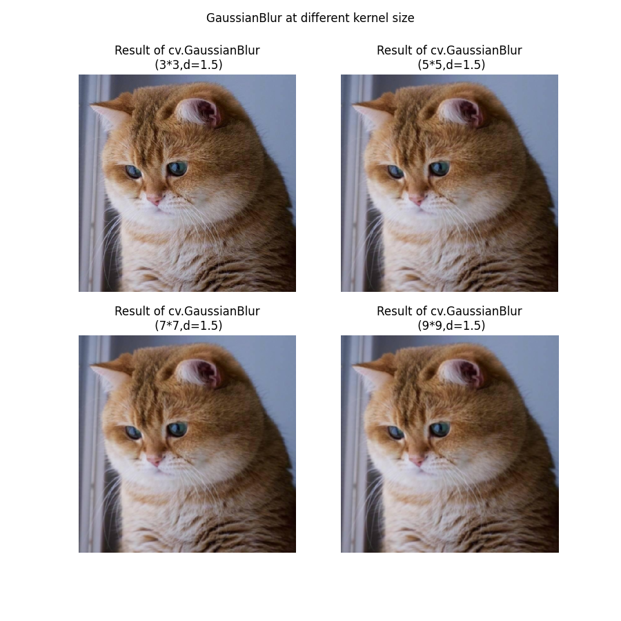
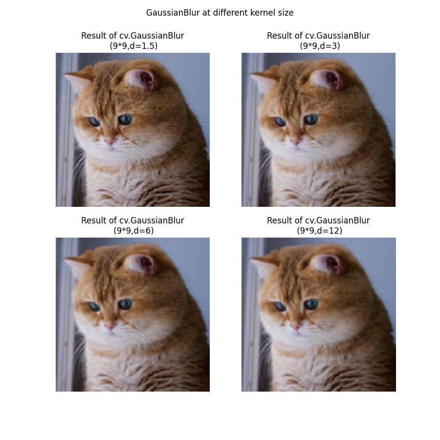

# 输入文件
从当前路径下读取cat.png文件作为图像输入。图像如下：

# 输出结果
将自己编写的高斯模糊代码得到的结果与原图和使用cv库中的GaussianBlur方法得到的结果进行比较。结果展示如下：

 图1 

将不同卷积核大小情况下，使用cv库中的GaussianBlur方法得到的结果进行对比。结果展示如下：

 图2 
  

将不同方差情况下，使用cv库中的GaussianBlur方法得到的结果进行对比。结果展示如下：
  

 图3 
  

# 结论
对比输出结果中的图1，可以发现自行编写的高斯模糊与使用cv库进行的高斯模糊效果几乎一致。
唯一的区别就是自行编写的高斯模糊会带有一个和卷积核尺寸相关的黑边。
这是因为编写代码时的卷积核不是从0行0列开始进行的。
从0行0列开始进行的卷积，卷积核有部分元素无法相乘。解决黑边合适的方式是原图进行零填充以实现相同大小的输出。

对比输出结果中的图2，可以发现同样的方差下，卷积核尺寸越大，高斯模糊效果越明显。  
对比输出结果中的图3，可以发现同样的卷积核下，方差越大，高斯模糊效果越明显。  
除此以外，我还发现卷积核尺寸固定时，方差增长对于模糊程度的提升似乎是有着上界的。
当方差成倍增大时，模糊程度上升并不明显。

# 依赖环境 
    * anyio==4.3.0 
    * argon2-cffi==23.1.0         
    * argon2-cffi-bindings==21.2.0  
    * arrow==1.3.0                  
    * asttokens==2.4.1            
    * async-lru==2.0.4            
    * attrs==23.2.0               
    * Babel==2.14.0                 
    * beautifulsoup4==4.12.3  
    * bleach==6.1.0  
    * certifi==2024.2.2  
    * cffi==1.16.0  
    * charset-normalizer==3.3.2  
    * colorama==0.4.6  
    * comm==0.2.1  
    * contourpy==1.2.0  
    * cycler==0.12.1  
    * debugpy==1.8.1  
    * decorator==5.1.1  
    * defusedxml==0.7.1  
    * executing==2.0.1  
    * fastjsonschema==2.19.1  
    * filelock==3.9.0  
    * fonttools==4.49.0    
    * fqdn==1.5.1  
    * fsspec==2023.4.0  
    * h11==0.14.0  
    * httpcore==1.0.4  
    * httpx==0.27.0  
    * idna==3.6  
    * ipykernel==6.29.3  
    * ipython==8.22.1  
    * ipywidgets==8.1.2  
    * isoduration==20.11.0  
    * jedi==0.19.1  
    * Jinja2==3.1.2  
    * json5==0.9.17  
    * jsonpointer==2.4  
    * jsonschema==4.21.1  
    * jsonschema-specifications==2023.12.1  
    * jupyter==1.0.0  
    * jupyter-console==6.6.3  
    * jupyter-events==0.9.0  
    * jupyter-lsp==2.2.3  
    * jupyter_client==8.6.0  
    * jupyter_core==5.7.1  
    * jupyter_server==2.12.5  
    * jupyter_server_terminals==0.5.2  
    * jupyterlab==4.1.2  
    * jupyterlab_pygments==0.3.0  
    * jupyterlab_server==2.25.3  
    * jupyterlab_widgets==3.0.10  
    * kiwisolver==1.4.5  
    * MarkupSafe==2.1.3  
    * matplotlib==3.8.3  
    * matplotlib-inline==0.1.6  
    * mistune==3.0.2  
    * mpmath==1.3.0  
    * nbclient==0.9.0  
    * nbconvert==7.16.1  
    * nbformat==5.9.2  
    * nest-asyncio==1.6.0  
    * networkx==3.2.1  
    * notebook==7.1.1  
    * notebook_shim==0.2.4  
    * numpy==1.26.3  
    * opencv-contrib-python==4.9.0.80  
    * opencv-python==4.9.0.80  
    * overrides==7.7.0  
    * packaging==23.2  
    * pandocfilters==1.5.1  
    * parso==0.8.3  
    * pillow==10.2.0  
    * platformdirs==4.2.0  
    * prometheus_client==0.20.0  
    * prompt-toolkit==3.0.43  
    * psutil==5.9.8  
    * pure-eval==0.2.2  
    * pycparser==2.21  
    * Pygments==2.17.2  
    * pyparsing==3.1.2  
    * python-dateutil==2.8.2  
    * python-json-logger==2.0.7  
    * pywin32==306  
    * pywinpty==2.0.13  
    * PyYAML==6.0.1  
    * pyzmq==25.1.2  
    * typing_extensions==4.8.0  
    * uri-template==1.3.0  
    * urllib3==2.2.1  
    * wcwidth==0.2.13  
    * webcolors==1.13  
    * webencodings==0.5.1  
    * websocket-client==1.7.0  
    * widgetsnbextension==4.0.10  
