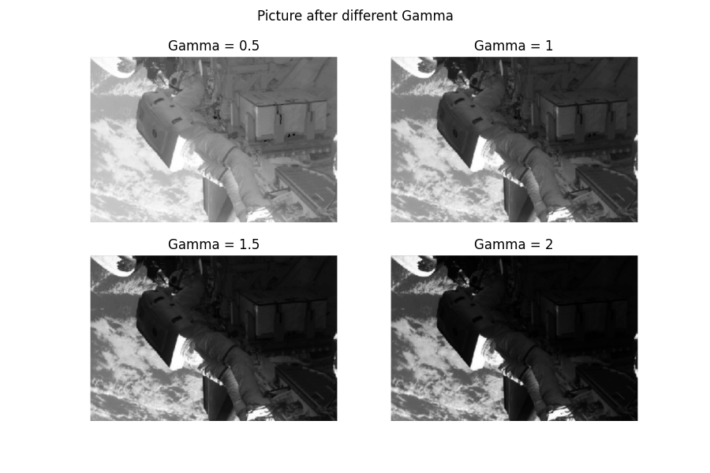

# 输入文件
从当前路径下读取space.png文件作为图像输入。图像如下：

# 输出结果
使用不同的方式对输入图片的灰度图进行直方图均衡、限制对比度自适应直方图均衡、伽马矫正，将所得的结果进行对比。展示如下：

 图1 

计算原图、经直方图均衡的图像、经限制对比度自适应直方图均衡的图像、经伽马矫正的图像的直方图。展示如下：

 图2 
  

调整不同的Gamma值进行Gamma矫正，结果展示如下：
  

 图3 

使用多种图像对Gamma矫正和CLAHE进行测试，结果展示如下：
  

 图4 

# 结论
观察输出结果的图1不难发现，直方图均衡后的图像暗部更明显，整体更亮。
CLAHE后的图像暗部得到了增强，同时亮部也变得更暗，整体的对比度显著降低。
使用Gamma值等于0.5的Gamma矫正后的图像比HE和CLAHE的图像更亮。 

图二则展示了不同处理后的直方图变化，HE让集中在50左右的峰值分散，
CLAHE则显著的降低了峰值的数量（同时其他点的数量也增加了），
Gamma矫正让直方图整体发生了右移，峰值出现在了100左右。

通过图三可以发现Gamma矫正的值越大图像越暗，值越小图像越亮。

图四展示了CLAHE和Gamma = 0.5的伽马矫正之间的对比。
伽马矫正通过让整张图片变亮的方式增强暗部。
CLAHE则让亮部和暗部对比度降低的情况下同时增强了暗部和亮部。

# 依赖环境 
    * anyio==4.3.0 
    * argon2-cffi==23.1.0         
    * argon2-cffi-bindings==21.2.0  
    * arrow==1.3.0                  
    * asttokens==2.4.1            
    * async-lru==2.0.4            
    * attrs==23.2.0               
    * Babel==2.14.0                 
    * beautifulsoup4==4.12.3  
    * bleach==6.1.0  
    * certifi==2024.2.2  
    * cffi==1.16.0  
    * charset-normalizer==3.3.2  
    * colorama==0.4.6  
    * comm==0.2.1  
    * contourpy==1.2.0  
    * cycler==0.12.1  
    * debugpy==1.8.1  
    * decorator==5.1.1  
    * defusedxml==0.7.1  
    * executing==2.0.1  
    * fastjsonschema==2.19.1  
    * filelock==3.9.0  
    * fonttools==4.49.0    
    * fqdn==1.5.1  
    * fsspec==2023.4.0  
    * h11==0.14.0  
    * httpcore==1.0.4  
    * httpx==0.27.0  
    * idna==3.6  
    * ipykernel==6.29.3  
    * ipython==8.22.1  
    * ipywidgets==8.1.2  
    * isoduration==20.11.0  
    * jedi==0.19.1  
    * Jinja2==3.1.2  
    * json5==0.9.17  
    * jsonpointer==2.4  
    * jsonschema==4.21.1  
    * jsonschema-specifications==2023.12.1  
    * jupyter==1.0.0  
    * jupyter-console==6.6.3  
    * jupyter-events==0.9.0  
    * jupyter-lsp==2.2.3  
    * jupyter_client==8.6.0  
    * jupyter_core==5.7.1  
    * jupyter_server==2.12.5  
    * jupyter_server_terminals==0.5.2  
    * jupyterlab==4.1.2  
    * jupyterlab_pygments==0.3.0  
    * jupyterlab_server==2.25.3  
    * jupyterlab_widgets==3.0.10  
    * kiwisolver==1.4.5  
    * MarkupSafe==2.1.3  
    * matplotlib==3.8.3  
    * matplotlib-inline==0.1.6  
    * mistune==3.0.2  
    * mpmath==1.3.0  
    * nbclient==0.9.0  
    * nbconvert==7.16.1  
    * nbformat==5.9.2  
    * nest-asyncio==1.6.0  
    * networkx==3.2.1  
    * notebook==7.1.1  
    * notebook_shim==0.2.4  
    * numpy==1.26.3  
    * opencv-contrib-python==4.9.0.80  
    * opencv-python==4.9.0.80  
    * overrides==7.7.0  
    * packaging==23.2  
    * pandocfilters==1.5.1  
    * parso==0.8.3  
    * pillow==10.2.0  
    * platformdirs==4.2.0  
    * prometheus_client==0.20.0  
    * prompt-toolkit==3.0.43  
    * psutil==5.9.8  
    * pure-eval==0.2.2  
    * pycparser==2.21  
    * Pygments==2.17.2  
    * pyparsing==3.1.2  
    * python-dateutil==2.8.2  
    * python-json-logger==2.0.7  
    * pywin32==306  
    * pywinpty==2.0.13  
    * PyYAML==6.0.1  
    * pyzmq==25.1.2  
    * typing_extensions==4.8.0  
    * uri-template==1.3.0  
    * urllib3==2.2.1  
    * wcwidth==0.2.13  
    * webcolors==1.13  
    * webencodings==0.5.1  
    * websocket-client==1.7.0  
    * widgetsnbextension==4.0.10  
