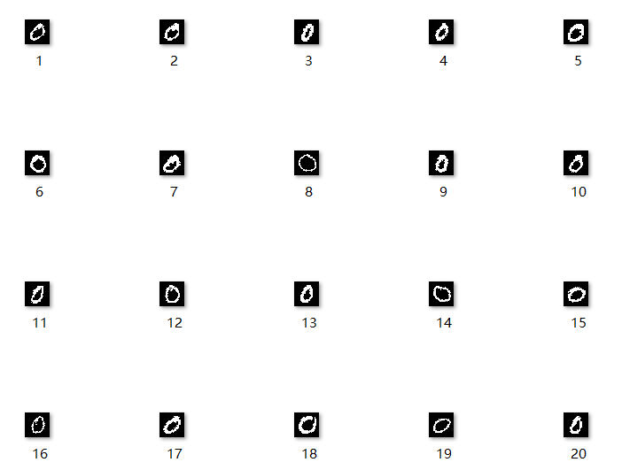
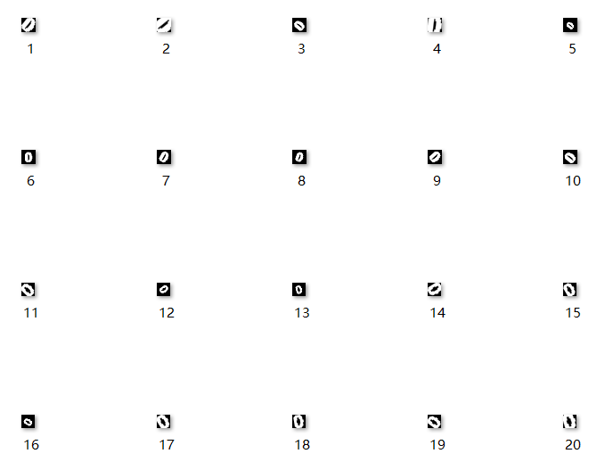
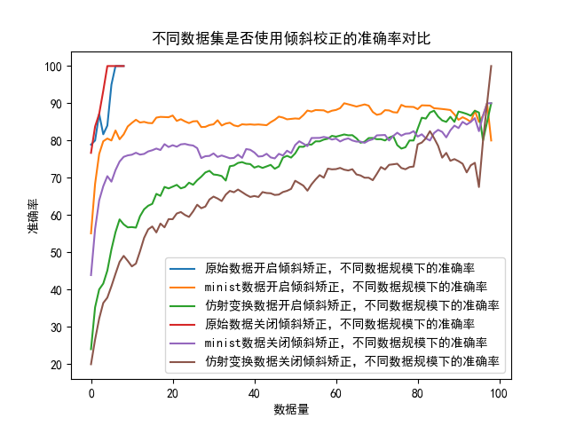
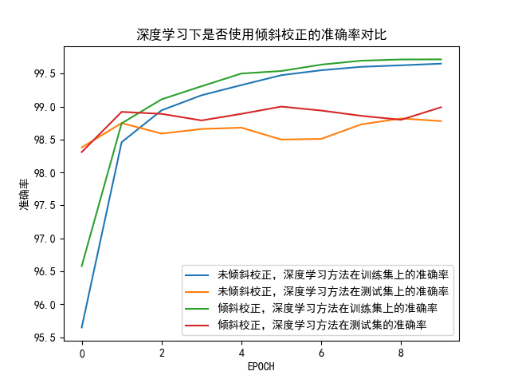

# 一、传统方法和深度学习方法对比  
## 1、传统方法
        传统方法的原始训练数据是./data/0 到./data/9下的手写数字图片。 这样子获得的数据集数据量很小，存在很大的偏差。  
    传统方法的过程为：读取图像，图像预处理，倾斜矫正，计算图像的方向梯度直方图HOG，训练支持向量机SVM，测试SVM。
#### 1.1 读取图像
        使用glob库的golbe方法，获得所有的图像的文件名。然后使用cv.imread读取这些图像。
#### 1.2 图像预处理
        使用cv.cvtColor转变为灰度图、cv.resize调整图像的大小。严格意义上倾斜矫正也属于图像预处理。
#### 1.3 倾斜矫正
        使用cv.moments获得图像的矩。图像的矩用于判断在y轴上的倾斜程度。并根据倾斜度生成一个仿射矩阵实现倾斜的矫正。  
    计算矩阵的矩使用了cv.moments方法，返回一个字典。
        其中：
        * mu02：y坐标的二阶中心矩，描述了在y轴上的倾斜情况。
        * mu11：x和y坐标的混合二阶中心矩。  
        使用这两个数据可以计算倾斜度，倾斜度是mu11/mu02。根据倾斜度，可以计算得到恢复倾斜所需的仿射矩阵。  
    使用cv.warpAffine应用仿射矩阵。
#### 1.4 计算HOG
        针对图像计算出图像的梯度分布直方图。首先使用cv.Sobel算子得到x和y方向的梯度，然后使用cv.cartToPolar准换为极坐标形式。  
    使用方向和幅度来描述这点的梯度。需要把梯度方向在弧度制下归约到16个值内（0-15）。最后把图像分割成四个区域，使用np.bincount()  
    统计四个区域中每个点的方向的加权直方图。
#### 1.5 训练SVM
        使用cv.ml创建一个线性核的支持向量机。使用指定的训练集分别按照是否有倾斜矫正进行SVM的训练（原始数据、MINIST数据、仿射变换增强的数据）。  
    对比svm.predict()结果和实际的lable的准确率。
#### 1.6 测试SVM
        题目给出的用于训练的数据集规模太小，每个数字10个，一共仅有100个。这直接导致模型存在较大的误差，  
    有时因为不同的读写顺序会存在加倾斜矫正之后的数据反而准确率更低的结论。
#### 1.7 数据集的改进
        针对这一问题，最直观的想法就是进行数据集的改进。这里我使用了两种方法：  
        第一种是从MINIST数据集中抽出一些的图像作为传统方法的数据集。使用MINIST数据集生成一个每种数字的图片数量为100的数据集（共1000张），  
    数据集例子如图1。对比不同数据规模和是否使用倾斜矫正时的准确率。 

 图1 

        第二种是对题目给出的数据集进行仿射变换得到新的增强之后的数据集。对数据集进行随机的-60度到60度的倾斜，0.5到1.5的放缩。  
    也生成一个每种数字的图片数量为100的数据集（共1000张），数据集例子如图2。对比不同数据规模和是否使用倾斜矫正时的准确率。
 

 图2 

        最后的测试结果如图3所示。

 图3 

        可以观察到SVM的准确率整体上随着数据规模变大而变高。在相同数据集下，使用倾斜校正的SVM方法准确率高于不使用倾斜矫正的SVM方法。
    但倾斜矫正的增益效果随数据集规模增大而递减。数据集越大，使用倾斜校正的准确率增益就越小。
## 2、深度学习方法
        深度学习方法从minist数据集进行训练和测试。 训练集有60000样本，测试集有10000样本。深度学习方法的过程为：数据准备、定义模型、  
    定义优化器和损失函数、训练模型、测试模型结果。
#### 2.1 数据准备
        使用torchvision.datasets加载MINIST数据集。使用DataLoader来创建可迭代的数据加载器，便于对数据进行变换和处理。
    使用transforms2.Lambda(deskew_tensor)调用deskew_tensor函数对数据集的张量进行倾斜矫正。
#### 2.2 定义模型
        模型定义了一个三层的卷积神经网络进行手写数字的识别。模型包括：
    *两个卷积层：第一个卷积层有64个过滤器，第二个卷积层有128个过滤器，都使用3x3的卷积核和ReLU激活函数。
    *最大池化层：在两个卷积层之后，使用2x2的窗口进行最大池化操作，步长为2。
    *全连接层：将卷积层的输出展平后，通过一个有1024个神经元的全连接层，再接一个输出层，输出层有10个神经元对应于10个类别的手写数字。
    *Dropout层：在全连接层中使用了Dropout技术，以概率0.5丢弃一些神经元，以减少过拟合。
#### 2.3 定义优化器和损失函数
        使用了Adam优化器torch.optim.Adam和交叉熵损失函数torch.nn.CrossEntropyLoss，对模型进行训练。
#### 2.4 训练模型
        训练模型阶段，在每个epoch中遍历数据加载器中的数据。根据BATCH的大小对每个批次的数据运行模型。把模型输出和标签值带入损失函数得到损失，  
    根据损失反向传播。使用优化器进行梯度下降，更新模型的权重。
#### 2.5 测试模型结果
        对深度学习方法，测试了模型进行倾斜校正和不进行倾斜矫正时对训练集和测试集的精度随EPOCH的变化。测试结果如图4所示。

 图4 

        
        可以看出EPOCH的增长可以提升在训练集上的准确率但是对测试集几乎没有明显提升。倾斜校正在深度学习方法中带来了一定提升，  
    但是提升幅度相当低（约0.1~0.2%）。
## 结论
    1.对比了SVM方法和深度学习方法。
    2.倾斜矫正在传统方法中效果明显而对深度学习效果提升微乎其微。且在SVM中倾斜矫正的增益效果随数据集规模增大而递减。
    3.仿射变换对数据带来了明显的增强。
# 依赖环境 
    anyio==4.3.0
    row==1.3.0
    asttokens==2.4.1
    async-lru==2.0.4
    attrs==23.2.0
    Babel==2.14.0
    beautifulsoup4==4.12.3      
    bleach==6.1.0
    certifi==2024.2.2
    cffi==1.16.0
    charset-normalizer==3.3.2   
    colorama==0.4.6
    comm==0.2.1
    contourpy==1.2.0
    cycler==0.12.1
    debugpy==1.8.1
    decorator==5.1.1
    defusedxml==0.7.1
    executing==2.0.1
    fastjsonschema==2.19.1
    filelock==3.9.0
    fonttools==4.49.0
    fqdn==1.5.1
    fsspec==2023.4.0
    h11==0.14.0
    httpcore==1.0.4
    httpx==0.27.0
    idna==3.6
    ipykernel==6.29.3
    ipython==8.22.1
    ipywidgets==8.1.2
    isoduration==20.11.0
    jedi==0.19.1
    Jinja2==3.1.2
    joblib==1.3.2
    json5==0.9.17
    jsonpointer==2.4
    jsonschema==4.21.1
    jsonschema-specifications==2023.12.1
    jupyter==1.0.0
    jupyter-console==6.6.3
    jupyter-events==0.9.0
    jupyter-lsp==2.2.3
    jupyter_client==8.6.0
    jupyter_core==5.7.1
    jupyter_server==2.12.5
    jupyter_server_terminals==0.5.2
    jupyterlab==4.1.2
    jupyterlab_pygments==0.3.0
    jupyterlab_server==2.25.3
    jupyterlab_widgets==3.0.10
    kiwisolver==1.4.5
    MarkupSafe==2.1.3
    matplotlib==3.8.3
    matplotlib-inline==0.1.6
    mistune==3.0.2
    mpmath==1.3.0
    nbclient==0.9.0
    nbconvert==7.16.1
    nbformat==5.9.2
    nest-asyncio==1.6.0
    networkx==3.2.1
    notebook==7.1.1
    notebook_shim==0.2.4
    numpy==1.26.3
    opencv-contrib-python==4.9.0.80
    opencv-python==4.9.0.80
    overrides==7.7.0
    packaging==23.2
    pandocfilters==1.5.1
    parso==0.8.3
    pillow==10.2.0
    platformdirs==4.2.0
    prometheus_client==0.20.0
    prompt-toolkit==3.0.43
    psutil==5.9.8
    pure-eval==0.2.2
    pycparser==2.21
    Pygments==2.17.2
    pyparsing==3.1.2
    python-dateutil==2.8.2
    python-json-logger==2.0.7
    pywin32==306
    pywinpty==2.0.13
    PyYAML==6.0.1
    pyzmq==25.1.2
    qtconsole==5.5.1
    QtPy==2.4.1
    referencing==0.33.0
    requests==2.31.0
    rfc3339-validator==0.1.4
    rfc3986-validator==0.1.1
    rpds-py==0.18.0
    scikit-learn==1.4.1.post1
    scipy==1.12.0
    Send2Trash==1.8.2
    six==1.16.0
    sniffio==1.3.1
    soupsieve==2.5
    stack-data==0.6.3
    sympy==1.12
    terminado==0.18.0
    threadpoolctl==3.4.0
    tinycss2==1.2.1
    torch==2.2.1+cu121
    torchaudio==2.2.1+cu121
    torchvision==0.17.1+cu121
    tornado==6.4
    traitlets==5.14.1
    types-python-dateutil==2.8.19.20240106
    typing_extensions==4.8.0
    uri-template==1.3.0
    urllib3==2.2.1
    wcwidth==0.2.13
    webcolors==1.13
    webencodings==0.5.1
    websocket-client==1.7.0
    widgetsnbextension==4.0.10

